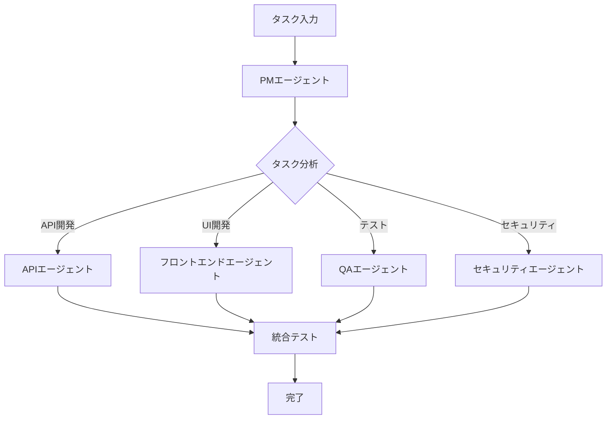

# エージェント定義書

## 1. 概要

このドキュメントは、プロジェクトに最適化されたAIエージェントの定義と役割を記述します。

## 2. コアエージェント一覧

### 2.1 エージェント概要

| エージェント名 | 説明 | 優先度 | 専門領域 |
|--------------|------|--------|----------|
| pm | プロジェクト管理・タスク調整 | High | プロジェクト全体管理 |

| next | Next.js 15フロントエンド開発 | High | Next.js 15, React 19, TypeScript |


| security | セキュリティ監査・実装 | Low | JWT, OAuth, 暗号化 |
| docs | ドキュメント管理 | Low | Markdown, OpenAPI |

## 3. エージェント詳細定義

### 3.1 pm エージェント

**責務:**
- プロジェクト全体の進捗管理
- タスクの優先順位付け
- 他エージェントへのタスク振り分け
- リスク管理と課題解決

**必要スキル:**
- アジャイル開発手法
- タスク分解と見積もり
- コミュニケーション調整


### 3.3 フロントエンドエージェント

**責務:**
- UIコンポーネントの実装
- 状態管理の設計
- APIとの連携実装
- パフォーマンス最適化

**技術スタック:**
- フレームワーク: nextjs
- スタイリング: CSS Modules/Tailwind CSS
- 状態管理: Context API/Redux/Zustand

## 4. エージェント連携フロー



## 5. 優先順位とリソース配分

### 5.1 フェーズ別優先順位

| フェーズ | 最優先エージェント | サポートエージェント |
|---------|-------------------|-------------------|
| 設計 | pm, api | docs, security |
| 開発 | api, frontend | qa |
| テスト | qa | security |
| リリース | pm, docs | すべて |

### 5.2 並列実行可能タスク

- API開発とフロントエンド開発
- ユニットテストと統合テスト準備
- ドキュメント作成とコードレビュー

## 6. 成功指標

### 6.1 エージェント別KPI

| エージェント | KPI | 目標値 |
|------------|-----|--------|
| pm | タスク完了率 | 90%以上 |
| api | APIレスポンスタイム | 500ms以下 |
| frontend | Lighthouseスコア | 90以上 |
| qa | テストカバレッジ | 80%以上 |
| security | 脆弱性検出数 | 0（Critical） |

## 7. エージェント設定

### 7.1 共通設定

```yaml
common:
  language: ja
  output_format: markdown
  code_style: clean-architecture
  test_first: true
```

### 7.2 カスタマイズ可能項目

- プログラミング言語
- フレームワークバージョン
- テストフレームワーク
- コーディング規約

---

*このドキュメントはAgentRemakerによって自動生成されました。*
*生成日時: 2025-08-27T08:23:17Z*
*プロジェクト固有の要件に応じて、エージェント定義をカスタマイズしてください。*
